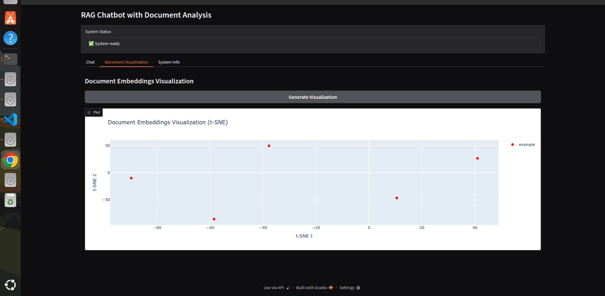
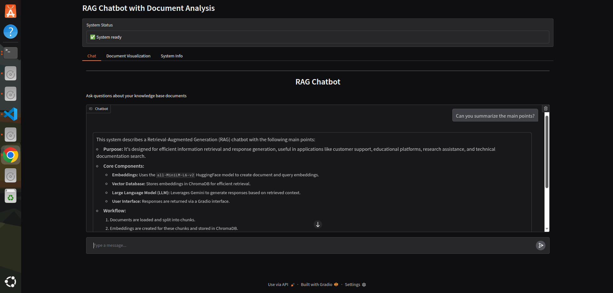
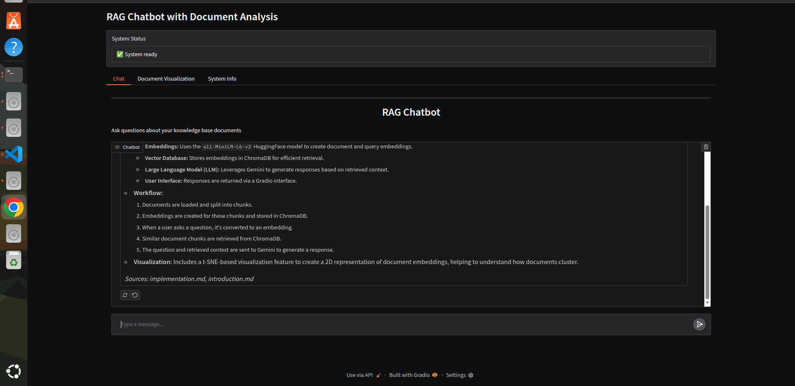

# DocuChat - RAG Chatbot with Document Analysis

<p align="center">
  
  
  
</p>

A powerful Retrieval-Augmented Generation (RAG) chatbot that allows you to chat with your documents using Google's Gemini AI. Built with LangChain, Chroma vector database, and Gradio for an intuitive web interface.

## 🚀 Features

- **Document Chat**: Ask questions about your documents in natural language
- **Multiple Document Types**: Supports Markdown files organized in folders
- **Vector Embeddings**: Uses HuggingFace embeddings for semantic search
- **Conversation Memory**: Maintains context across conversations
- **Document Visualization**: Interactive t-SNE visualization of document embeddings
- **Source Citations**: Shows which documents were used to answer your questions
- **Web Interface**: Clean, user-friendly Gradio interface
- **Free to Use**: Uses free HuggingFace embeddings (no OpenAI API required)

## 📋 Prerequisites

- Python 3.8 or higher
- Google AI API key (Gemini)
- Git (for cloning the repository)

## 🛠️ Installation

1. **Clone the repository**

   ```bash
   git clone git@github.com:1morshed1/DocuChat.git
   cd docuchat
   ```

2. **Install dependencies**

   ```bash
   pip install -r requirements.txt
   ```

3. **Set up environment variables**

   Create a `.env` file in the project root:

   ```bash
   touch .env
   ```

   Add your Google AI API key:

   ```
   GOOGLE_API_KEY=your_google_ai_api_key_here
   ```

4. **Create knowledge base directory**
   ```bash
   mkdir knowledge-base
   ```

## 🔑 Getting Your Google AI API Key

1. Go to [Google AI Studio](https://makersuite.google.com/app/apikey)
2. Sign in with your Google account
3. Click "Create API Key"
4. Copy the generated API key
5. Add it to your `.env` file

## 📁 Project Structure

```
docuchat/
├── main.py                 # Main application file
├── .env                    # Environment variables (create this)
├── requirements.txt        # Python dependencies
├── README.md              # This file
├── knowledge-base/        # Your documents go here
│   ├── folder1/
│   │   ├── document1.md
│   │   └── document2.md
│   └── folder2/
│       └── document3.md
└── vector_db/            # Vector database (auto-created)
```

## 📚 Adding Your Documents

1. **Create folders** in the `knowledge-base` directory for different document categories
2. **Add Markdown files** (`.md` extension) to these folders
3. **Organize by topic** - each folder represents a document type/category

Example structure:

```
knowledge-base/
├── research/
│   ├── paper1.md
│   └── paper2.md
├── documentation/
│   ├── api-guide.md
│   └── user-manual.md
└── notes/
    └── meeting-notes.md
```

## 🚀 Usage

1. **Start the application**

   ```bash
   python main.py
   ```

2. **Open your browser**

   - The interface will automatically open at `http://127.0.0.1:7860`
   - Or manually navigate to the URL shown in the terminal

3. **Use the interface**
   - **Chat Tab**: Ask questions about your documents
   - **Document Visualization**: View how your documents are organized in vector space
   - **System Info**: Check system status and configuration

## 💬 Example Queries

- "What are the main topics covered in the research papers?"
- "Can you summarize the key findings from the documentation?"
- "What did we discuss in the last meeting?"
- "Compare the approaches mentioned in different documents"
- "What are the technical requirements mentioned?"

## 🔧 Configuration

### Model Settings

- **Default Model**: `gemini-2.5-flash`
- **Temperature**: 0.7 (adjustable in code)
- **Chunk Size**: 1000 characters
- **Chunk Overlap**: 200 characters
- **Retrieved Documents**: Top 3 most relevant

### Embedding Model

- **Default**: `sentence-transformers/all-MiniLM-L6-v2`
- Free to use, no API key required
- Good balance of speed and accuracy

## 🐛 Troubleshooting

### Common Issues

**System not initialized**

- Check that your `GOOGLE_API_KEY` is set in the `.env` file
- Ensure the `knowledge-base` folder exists and contains `.md` files
- Verify all dependencies are installed

**Vector database errors**

- Delete the `vector_db` folder and restart the application
- The system will automatically recreate the database

**Port already in use**

- Change the port in `main.py` (line with `server_port=7860`)
- Or kill the process using port 7860

**Encoding issues**

- Ensure your `.md` files are saved in UTF-8 encoding
- Check for special characters that might cause issues

**API key errors**

- Verify your Google AI API key is valid and active
- Check you haven't exceeded rate limits

### Debug Mode

For more detailed error information, check the terminal output when running the application. The system provides detailed logging for troubleshooting.

## 🚀 Advanced Usage

### Customize Embeddings

You can change the embedding model in the `create_vectorstore()` function:

```python
embeddings = HuggingFaceEmbeddings(model_name="your-preferred-model")
```

### Adjust Retrieval Parameters

Modify the number of retrieved documents:

```python
retriever = vectorstore.as_retriever(search_kwargs={"k": 5})  # Retrieve top 5
```

### Change the LLM Model

Switch to a different Gemini model:

```python
MODEL = "gemini-pro"  # or other available models
```

## 🔒 Privacy & Security

- All processing happens locally on your machine
- Documents are stored in a local vector database
- Only queries are sent to Google's API (not your documents)
- No data is shared or stored externally

## 🤝 Contributing

1. Fork the repository
2. Create a feature branch (`git checkout -b feature/amazing-feature`)
3. Commit your changes (`git commit -m 'Add amazing feature'`)
4. Push to the branch (`git push origin feature/amazing-feature`)
5. Open a Pull Request

## 📄 License

This project is licensed under the MIT License - see the [LICENSE](LICENSE) file for details.

## 🙏 Acknowledgments

- [LangChain](https://langchain.com/) - Framework for LLM applications
- [Chroma](https://www.trychroma.com/) - Vector database
- [Gradio](https://gradio.app/) - Web interface framework
- [HuggingFace](https://huggingface.co/) - Embedding models
- [Google AI](https://ai.google/) - Gemini language model

---

**Made with ❤️ using Python, LangChain, and Google AI**
